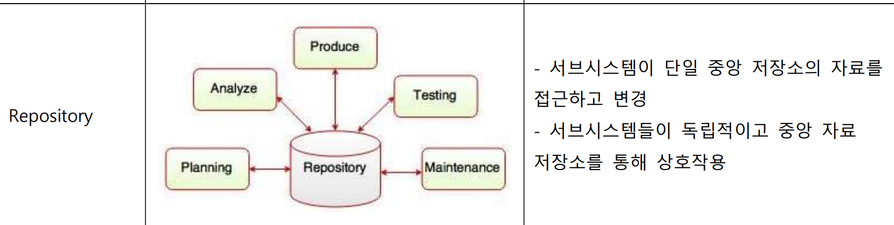
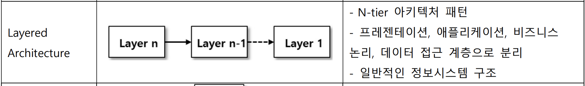
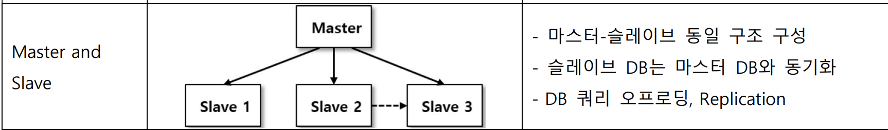
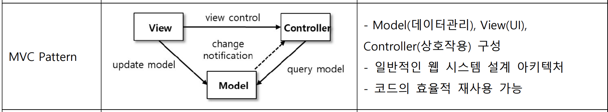
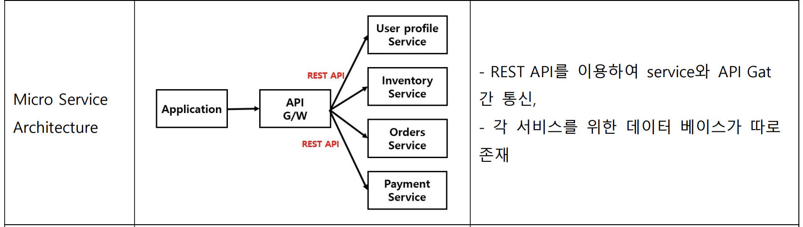
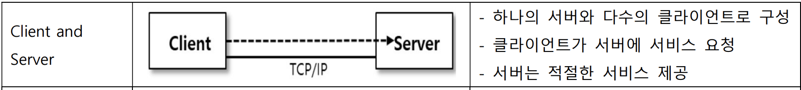

## SW 아키텍처 패턴 개념도
1. Repository 패턴
    > 
2. Layered 패턴
   > 
3. Master Slave 패턴
   > 
4. MVC 패턴
   > 
5. Micro Service 패턴
   > 
6. Client Server 패턴
   > 

## Layered Architecture

+ 보통 3 layer로 구성
  + Controller (Presentation 계층)
    + 어플리케이션 요청과 응답 처리하는 관문의 역할
    + 최상위 Layer
  + Service (Business Logic 계층)
    + 비즈니스를 수행하기 위한 핵심적인 비즈니스 로직이 구현되는 단계
  + Repository  (Data Access 계층)
    + 비즈니스를 수행하면서 데이터에 접근해야 하는 케이스를 제어하는 계층 
  + 
